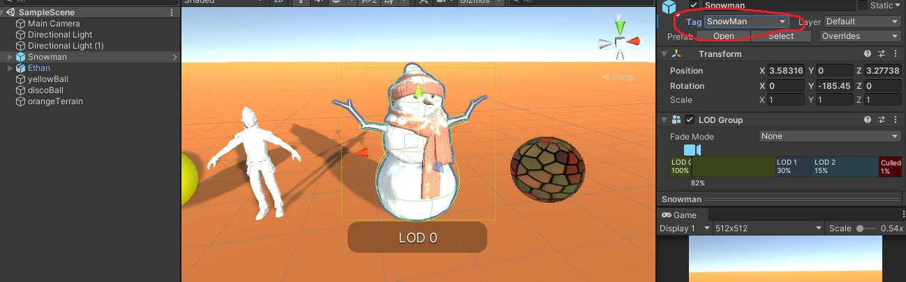

# Interfaces Inteligentes - Práctica 1

- ### Incluir dos objetos 3D básicos, por ejemplo 2 esferas:

Para poder distinguir más facilmente a cada una de las esferas se les ha asignado una textura diferente.

- ### Incluir un personaje com Ethan, de los Standard Assets:

- ### Incluir un objeto libre de la Asset Store que no sea de los Standard Assets:

- ### Crear un terreno:

He recortado la imagen para que se vea en el inspector que, efectivamente, he creado un objeto terreno.

- ### Cada objeto debe tener una etiqueta que lo identifique:

- ### La escena debe tener 2 fuentes de luz:

He levantado la camara de manera que se pueda apreciar como interactuan los objetos con las dos fuentes de luz, tambien debo destacar que la textura de esfera denominada discoBall tiene una propiedad que impide que pueda desprender sombras, es por ello por lo que no aparece ninguna.

- ### Agregar un script que escriba en la consola los objetos que se han utilizado:

- ### Agregar un script  un identificador numérico que le asignes a cada uno de los objetos  y el valor de un contador que se actualiza en cada iteración para cada objeto:

## [Enlace al código](Scripts)